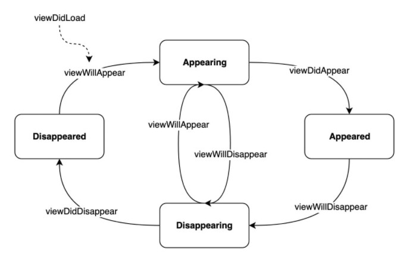
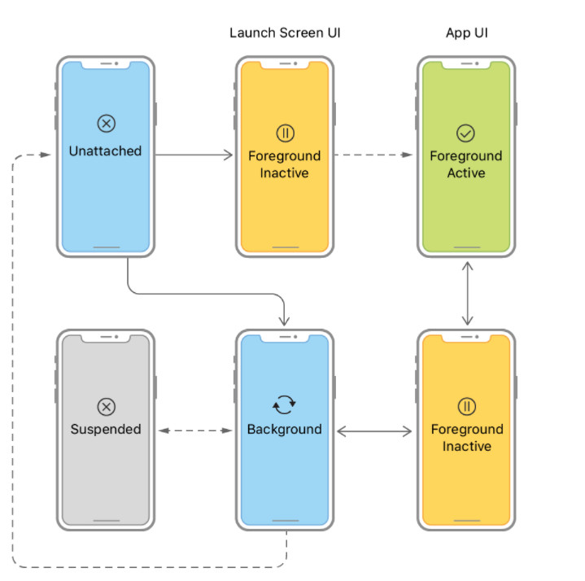
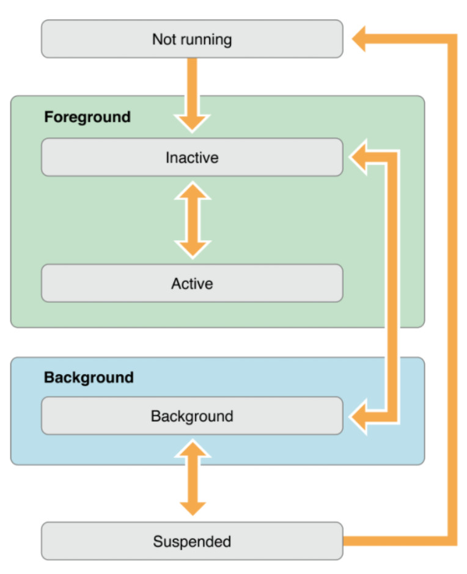

# IOS Life Cycle

## View Controller Life Cycle

more info:
[LearnAppMaking](https://learnappmaking.com/view-controller-uiviewcontroller-ios-swift/)

## App's Life Cycle

more info:
[apple doc](https://developer.apple.com/documentation/uikit/app_and_environment/managing_your_app_s_life_cycle), [medium](https://medium.com/@neroxiao/ios-app-life-cycle-ec1b31cee9dc)
