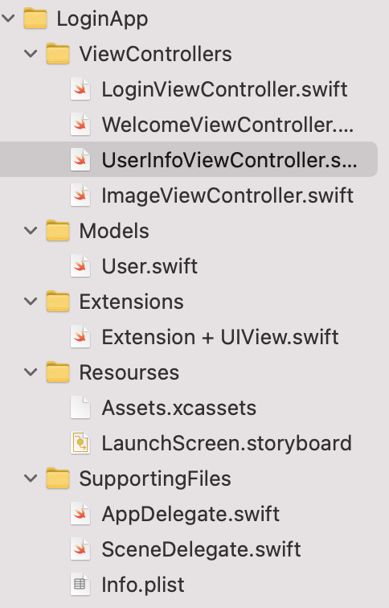
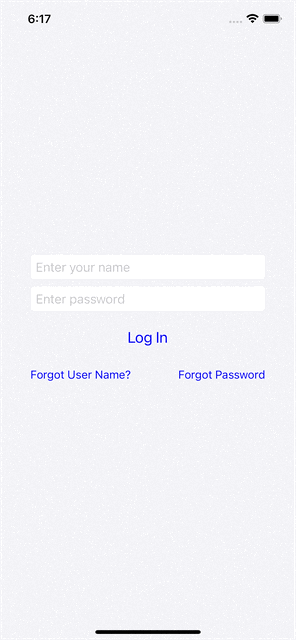

# Model-View-Controller
What we know:
1. How to work with the **MVC** structure
- more info about **MVC** [here](https://developer.apple.com/library/archive/documentation/General/Conceptual/DevPedia-CocoaCore/MVC.html)
2. Сreating a **model** and transferring data to other controllers. Use **static func** in model, to get mock user

- [Use Code](https://github.com/TRex-Dino/SwiftBook-online-lessons/tree/main/MVC/Code)
3. Use **NSLayoutConstraint**
4. **stackView**
5. **UITextFieldDelegate**, use two method: **touchesBegan**, **textFieldShouldReturn**
6. Use **UIAlertController**
7. Use **UITabBarController**(), setting **UITabBarItem**, title and image icon
8. Use **UINavigationController**, setting title, use **pushViewController(ImageViewController(), animated: true)**
- [Use Storyboard](https://github.com/TRex-Dino/SwiftBook-online-lessons/tree/main/MVC/Code)
9. To get current ViewController we use **tabBarController.viewControllers**, use forEach method and **casting** element to our VC
10. Use **didset** to round the corners of the image
## Building an app using code:

