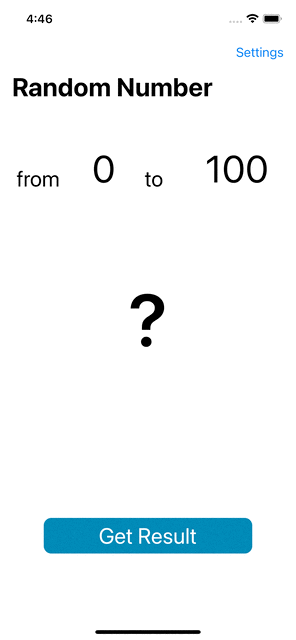

# Type cast
What we know:
1. How to use casting type: is, as
- [TypeCast](https://github.com/TRex-Dino/SwiftBook-online-lessons/tree/main/TypeCast/TypeCast.playground)
- more info about **type casting** here [here](https://docs.swift.org/swift-book/LanguageGuide/TypeCasting.html)
2. In iphone we use two segue: 
_Show (Push)_ we use when have navigation controller and _Present Modally_, we use to displays the view controller modally
- more info about **segue** here [here](https://developer.apple.com/library/archive/featuredarticles/ViewControllerPGforiPhoneOS/UsingSegues.html)
- apple recommend add a button cancel, to go back the screen 
3. Prepare for segue:
- to transfer data to another screen, we need to prepare next VC
- use segue.destination and casting to our type ViewController(which we need data)
4. Unwind for segue:
- to transfer data to last screen, we also use segue Storyboard
- Add @IBAction in FirstVC and connect the button in SecondVC
- use segue.source casting to our type ViewController(which we need data).
## create app:

